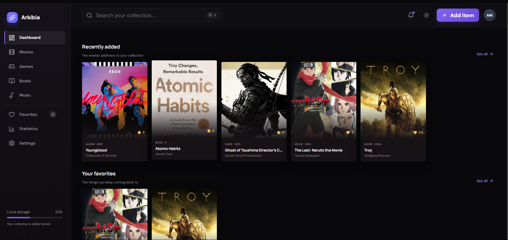
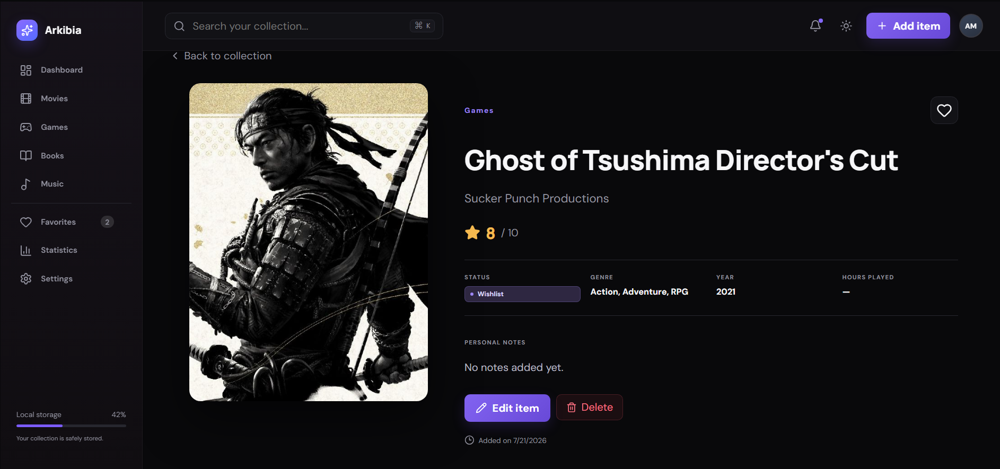
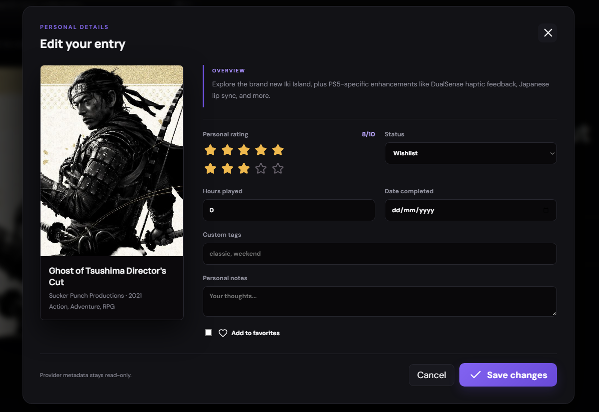

# Arkibia

Arkibia is a responsive personal media library for organizing movies, games, books, and music. It uses public media providers so users can search for a title and save it without manually entering its metadata.

> **Project status:** Arkibia is still in development. The database and hosted backend are not finished yet, so collections currently persist only in the browser's local storage. Supabase integration is planned but is not currently active.

## Preview

### Dashboard



### Collection details



### Edit entry



## Features

- Movies powered by TMDb
- Games powered by RAWG
- Books powered by Open Library
- Music powered by MusicBrainz and Cover Art Archive
- Debounced, cached provider search
- Personal ratings, statuses, notes, favorites, tags, and completion dates
- Dashboard, favorites, statistics, global search, and collection details
- Dark and light themes
- JSON import and export
- Local persistence with an architecture prepared for Supabase
- Responsive desktop, tablet, and mobile layouts

## Technology

- React, TypeScript, and Vite
- React Router and Zustand
- Framer Motion and Recharts
- Lucide React

## Local development

Requires Node.js 20 or newer.

```bash
npm install
npm run dev
```

Create a production build:

```bash
npm run build
```

## Environment variables

Copy `.env.example` to `.env.local` and add your own keys:

```env
VITE_TMDB_API_KEY=your_tmdb_api_key
VITE_RAWG_API_KEY=your_rawg_api_key
```

Open Library, MusicBrainz, and Cover Art Archive require no keys.

Environment files containing credentials are ignored by Git. Never commit `.env`, `.env.local`, a Supabase service-role key, or any private credential. Variables prefixed with `VITE_` are included in the browser bundle, so only use credentials intended for client-side applications.

## Media providers

Provider integrations are isolated in `src/services`:

```text
src/services/
  client.ts
  media.ts
  tmdb.ts
  rawg.ts
  openLibrary.ts
  musicBrainz.ts
```

`media.ts` exposes a common provider interface, keeping the UI independent from individual API implementations.

## Storage and Supabase

The Zustand store currently persists collections locally. `src/services/collectionRepository.ts` defines a storage contract so Supabase can replace local storage without coupling the UI to the database.

For Supabase:

1. Install `@supabase/supabase-js`.
2. Add `VITE_SUPABASE_URL` and `VITE_SUPABASE_PUBLISHABLE_KEY` to `.env.local`.
3. Add Supabase authentication.
4. Create a `collection_items` table containing `user_id`, the external media ID, category, and personal fields.
5. Enable Row Level Security and restrict every operation to `auth.uid() = user_id`.
6. Implement `CollectionRepository` using the Supabase client.

Only the publishable key belongs in the frontend. Never use a Supabase service-role key here.

## Collection data

Personal collection records contain:

- Category and external provider ID
- Personal rating and status
- Favorite state
- Notes and custom tags
- Hours played for games
- Date added, updated, and completed

Provider metadata includes titles, artwork, descriptions, genres, creators, release dates, platforms, publishers, and track lists.

## Project structure

```text
src/
  components/     Reusable UI and modal components
  services/       Media providers and storage repositories
  App.tsx         Routes and primary application views
  store.ts        Collection state and local persistence
  types.ts        Shared TypeScript models
```

## Security

- Real API keys are not stored in source files.
- `.env` and local environment variants are excluded by `.gitignore`.
- API searches are debounced and cached.
- Supabase deployments must enable Row Level Security before client access.
- Rotate a credential immediately if it was previously committed or shared. Removing it from the working tree does not remove it from Git history.

## License

This project is intended for personal and educational use. Media artwork and metadata remain subject to their respective providers' terms and licenses.
